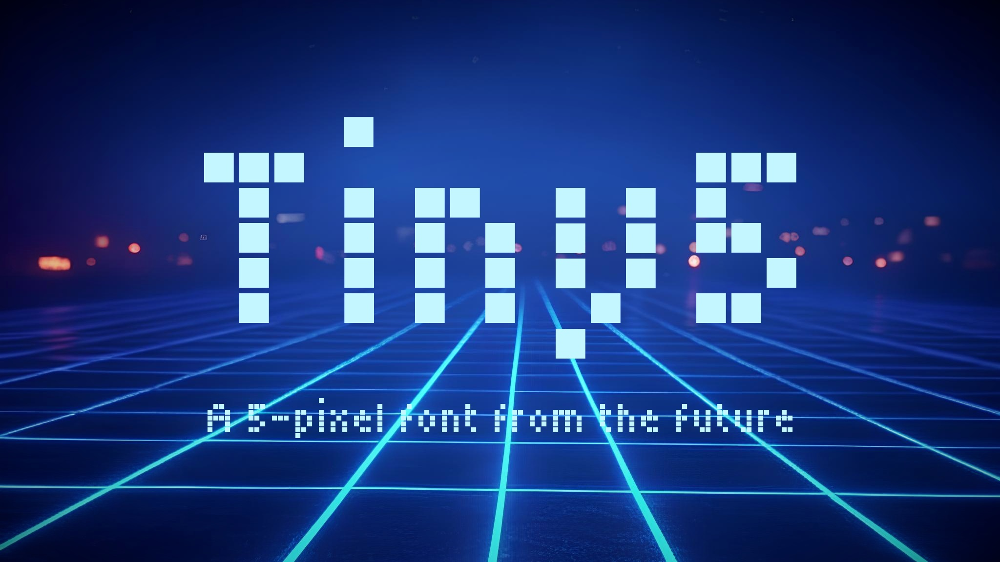
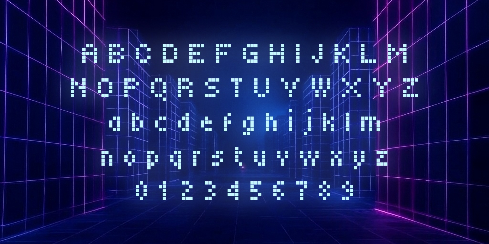
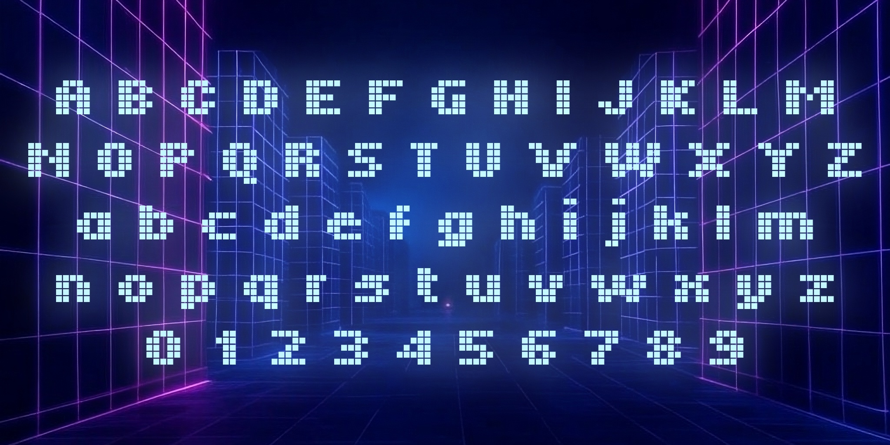
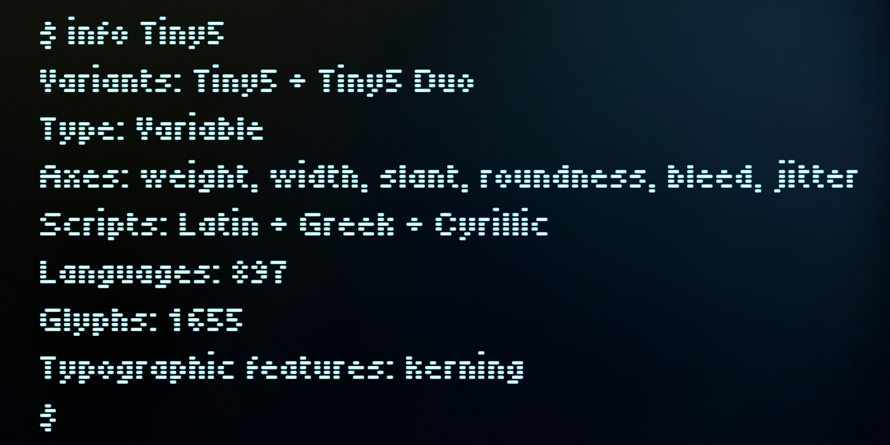
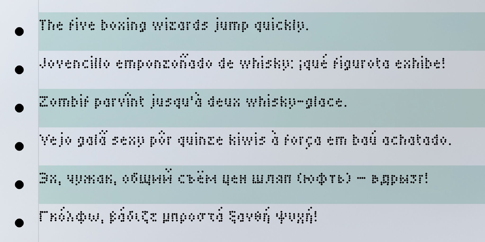

# Tiny5

**Tiny5** is a compact 5-pixel variable font that captures the essence of 1980s–90s digital minimalism. Inspired by the graphing calculators and pocket gadgets of the era, it distills letterforms to their absolute essentials—proving that even at just five pixels tall, clarity, charm, and personality can thrive together.

It features six variable axes — **Weight, Width, Slant, Roundness, Bleed and Jitter** — giving you precise control over its look: from crisp geometric shapes and sharp LCD edges to the soft glow of CRT monitors and the subtle ink spread of dot-matrix printers. A **Tiny5 Duo** variant has been added for bolder emphasis while staying true to the pixel-perfect aesthetic.

Tiny5 excels at evoking retro-futurism, constrained-tech nostalgia, and clean minimalism. It’s especially well-suited for:

- Pixel art and lo-fi games
- Terminal-style interfaces and embedded systems
- Micro-typography in UI/UX design
- Branding with a distinct 8/16-bit or vintage electronics vibe

The family provides broad language support, covering **Latin, Greek, and Cyrillic scripts** across **892 languages** and **1,655 glyphs**.

For pixel-perfect rendering, use font sizes that are **multiples of 6 points**.

Tiny5 is also available in [BDF](https://en.wikipedia.org/wiki/Glyph_Bitmap_Distribution_Format) format for seamless integration with the [mcu-renderer](https://github.com/Gissio/mcu-renderer), [u8g2](https://github.com/olikraus/u8g2) and [TFT_eSPI](https://github.com/Bodmer/TFT_eSPI) libraries.

## About

Stefan Schmidt is an electrical engineer with graduate studies in signal processing, multimodal artistic languages and sociology. Fascinated by the interplay between the virtual and the real, his work probes the boundaries between perception and technology.

Learn more at [http://www.stefanschmidtart.com](http://www.stefanschmidtart.com).

## Building

Fonts are built automatically by GitHub Actions — take a look in the "Actions" tab for the latest build.

If you want to build fonts manually on your own computer:

- `make build` will produce font files.
- `make test` will run [Fontspector](https://fonttools.github.io/fontspector/)'s quality assurance tests.
- `make proof` will generate HTML proof files.

## Changelog

### 2.003

- Renamed bold weight to **Tiny5 Duo** variant.
- Added axes: **Width**, **Slant** and **Jitter**.
- Renamed axes: **Element Size** → **Weight**.
- Fixes: latin uppercase q, latin lowercase x, comma, semicolon, double angle quotation marks, double acute, double grave, latin small sharp s, greek capital delta, greek capital xi, greek lowercase epsilon, greek lowercase phi, greek lowercase psi, greek descenders, cyrillic capital ghe, various diacritics.

### 2.002

- Fixes: percent sign, latin lowercase j, various cyrillic glyphs, various hooks and descenders.

### 2.001

- Minor fixes.

### 2.000

- Added variable font support with axes for: **Element Size**, **Roundness** and **Bleed**.
- Added bold weight.
- Added vietnamese support (Google Fonts Latin Vietnamese character set).
- Added Google Fonts Latin Beyond, Latin PriAfrican, Greek Plus and Greek Pro character sets.
- Improved build workflow with [bdf2ufo](https://github.com/Gissio/bdf2ufo).
- Major corrections to the greek and cyrillic character sets.
- Updated presentation image and samples.

### 1.002

- Added Google Fonts Greek Core, Cyrillic Core and Cyrillic Plus character sets.

### 1.001

- Added Google Fonts Latin Plus and Latin African character sets.
- Major corrections.

### 1.000

- First release.

## License

This Font Software is licensed under the SIL Open Font License, Version 1.1.
This license is available with a FAQ at https://openfontlicense.org
