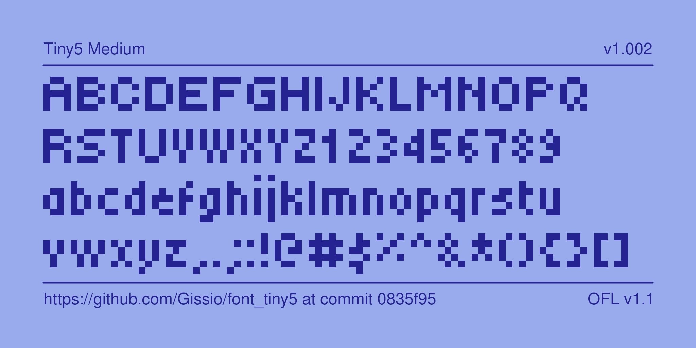
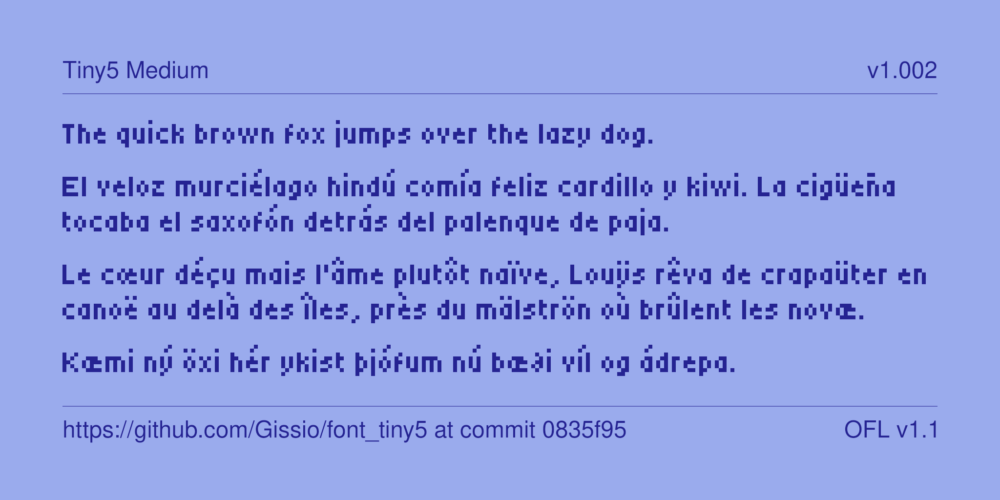

# tiny5

tiny5 is a variable-width, 5-pixel font playing with the concept of least amount of information that produces both legible and aesthetically pleasing text.

It is inspired by the graphing calculators and digital gadgets of the 1980s-90s, where the constraints of limited pixel space demanded efficient and minimalist design. It can be used for invoking a retro or nostalgic feel, for conveying the idea of minimalism, or for efficiently presenting information on small displays.

tiny5 supports the Google Fonts Latin Kernel, Latin Core, Latin Plus, Latin African, Greek Core, Cyrillic Core and Cyrillic Plus character set.

The font is also available in [BDF](https://en.wikipedia.org/wiki/Glyph_Bitmap_Distribution_Format) format for easy integration with the [mcu-renderer](https://github.com/Gissio/mcu-renderer), [u8g2](https://github.com/olikraus/u8g2) and [TFT_eSPI](https://github.com/Bodmer/TFT_eSPI) libraries.

## Overview

## Sample

## Changelog

### 1.002

* Added Google Fonts Greek Core, Cyrillic Core and Cyrillic Plus character sets.

### 1.001

* Added Google Fonts Latin Plus and Latin African character sets.
* Major corrections.

### 1.000

* First release.

## Build

With Python 3.10 or newer, install the `requirements.txt` and run this command:

    gftools builder sources/config.yaml

## Designer profile

Stefan Schmidt is an electrical engineer with graduate studies in signal processing, combined artistic languages and sociology. Fascinated by the interplay between the virtual and the real, his work probes the boundaries between perception and technology.

Learn more at [http://www.stefanschmidtart.com](http://www.stefanschmidtart.com).

## License

This Font Software is licensed under the SIL Open Font License, Version 1.1. This license is available with a FAQ at: https://scripts.sil.org/OFL
